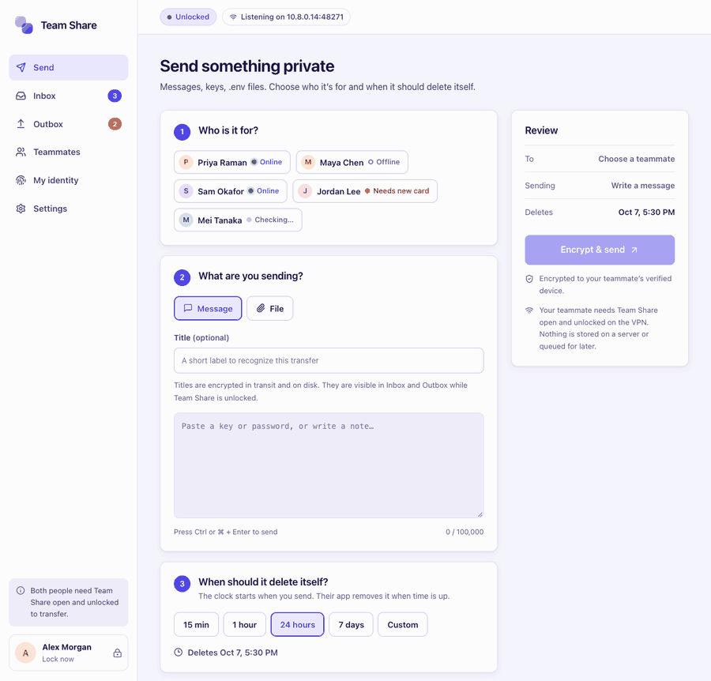
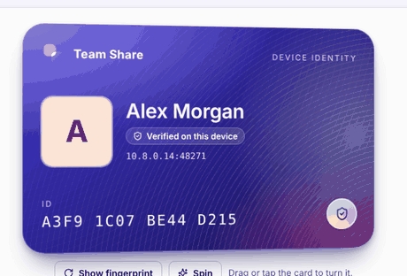
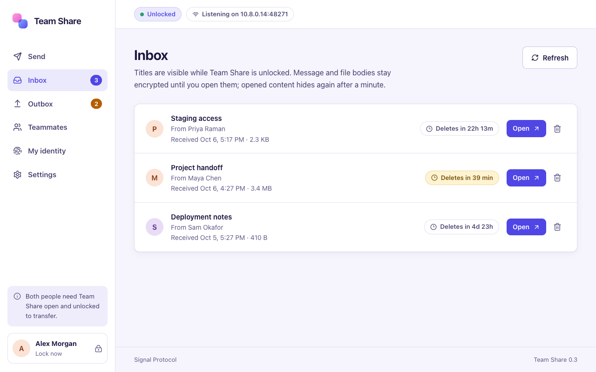
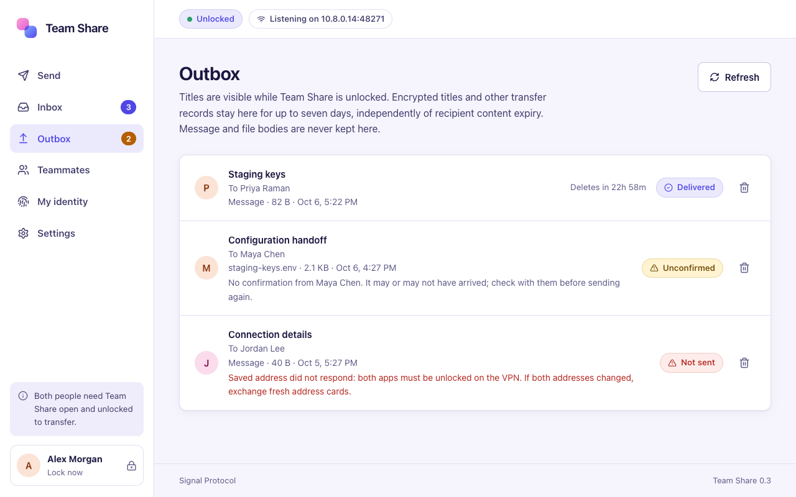
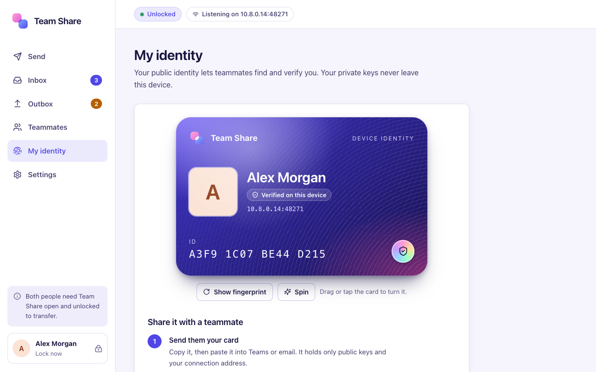
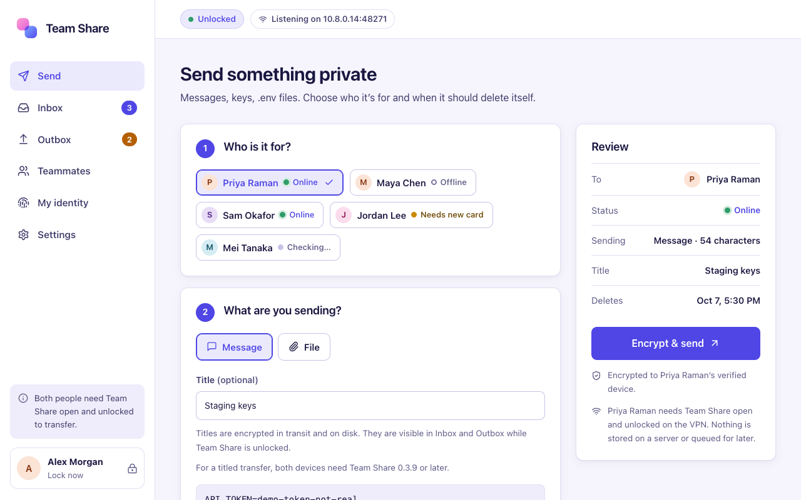

 

&nbsp;

&nbsp;

**Send a key, a password or a file to a coworker. It goes straight to their device, then deletes itself.**

 

## See it in 20 seconds

Pick who it is for. Write a note or choose a file. Choose when it should delete itself. Done. Team Share checks whether your teammate is reachable before you send and records the delivery outcome.

 

 

## Your ID card

Every device gets its own identity. Yours is a card you can tilt, spin and flip to see the fingerprint your teammate checks against.

 

 

## A look around

<table>
<tr>
<td width="50%"> <b>Inbox.</b> Titles are visible while unlocked; message and file bodies stay sealed until opened.</td>
<td width="50%"> <b>Outbox.</b> Delivered, unconfirmed or not sent, with plain-language reasons.</td>
</tr>
<tr>
<td width="50%"> <b>My identity.</b> Share your card, compare fingerprints.</td>
<td width="50%"> <b>Send.</b> Pick a teammate, add a title, set the expiry.</td>
</tr>
</table>

Screenshots use made-up people and sample data.

 

## Get it

Grab the newest build from the **[latest release](https://github.com/AndrewR3K/team-share-releases/releases/latest)**.

<b>Mac (Apple Silicon)</b>

 

1. Download the Mac file from the release and install it.
2. Open Team Share, join your company VPN, and create your device with a long, unique passphrase (16 characters minimum). **There is no recovery option**, so keep that passphrase safe.
3. After the first install, Team Share checks for updates by itself at startup and every six hours. Look for **App updates** on the lock screen or in Settings. Installing needs the app locked and a click to confirm.

<b>Windows (x64)</b>

 

1. Download the `.exe` installer from the release and run it. If a checksum file is attached, you can compare its SHA-256 with your download.
2. The installer is not code-signed yet, so Windows may say **"Windows protected your PC"**. Choose **More info**, then **Run anyway**.
3. Your PC needs a **TPM 2.0 chip**. Team Share wraps its keys with the TPM and has no software fallback.
4. Windows may ask to allow Team Share through the firewall. It listens only on your VPN address, on UDP port 48271.
5. Windows has no automatic updates yet. For each new version, download the new installer from here.

<b>What your network needs</b>

 

Both people must be on the same company VPN, and the VPN must allow device-to-device UDP traffic on port **48271**. If a transfer cannot reach someone, that is the first thing to check.

 

## Your first handoff

1. **Open Team Share on both computers** and make sure you are both on the VPN.
2. **Swap ID cards.** On **My identity**, copy your card and send it to your teammate, then paste theirs under **Teammates**.
3. **Compare the full fingerprint** out loud or over a channel you trust. Confirm the pairing dialog.
4. **Send.** Choose them, write a message or pick a file, set an expiry, and press **Encrypt & send**.
5. **The transfer appears in their Inbox while their app is unlocked.** Opened content hides again after a minute.

Pair once with each teammate’s device. A replaced or reset device needs pairing again.

 

## Good to know

<b>Is there a server in the middle?</b>

 

No. Devices connect directly over your VPN. There is no mailbox, relay or cloud copy of anything you send. The flip side is that **both people need Team Share open and unlocked** at the same moment.

<b>What if my teammate is offline?</b>

 

Team Share tells you before you send and keeps nothing to retry later. Your Outbox shows each transfer as **Delivered**, **Unconfirmed** or **Not sent**. Unconfirmed means it may or may not have arrived, so check with them before sending again.

<b>How big can a transfer be?</b>

 

Up to 10 MiB for each message or file. An inbox holds up to 100 items. Expiry can be set from minutes up to 7 days.

<b>What does "deletes itself" really mean?</b>

 

Expired content cannot be opened. The receiving app removes its local copy while running; if it was closed or asleep, cleanup resumes when it runs again. This does not prevent screenshots, backups or someone saving the content. Exported files and your own original are yours to manage.

<b>I forgot my passphrase.</b>

 

There is no reset by design, because nobody else, including us, can unlock your device. You would create a new device and pair with your teammates again.

 

## Under the hood

| | |
|---|---|
| **Messaging** | Signal's official `libsignal` with PQXDH post-quantum key agreement |
| **Transport** | Authenticated QUIC (iroh), direct between private VPN addresses. No relays and no public discovery |
| **On disk** | XChaCha20-Poly1305, with a key protected by Argon2id and the Secure Enclave (Mac) or TPM (Windows) |
| **App** | Tauri 2, Rust and React |
| **Platforms** | macOS on Apple Silicon, Windows x64 |

 

Release notes live on the <a href="https://github.com/AndrewR3K/team-share-releases/releases">releases page</a>.

